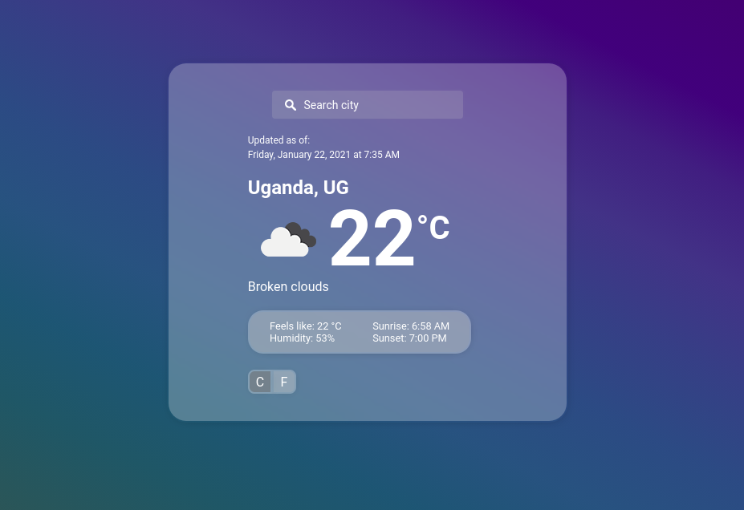

# JS WEATHER APP

> This Weather App project is created to test knowledge about asynchronous communication with promises or async/await and when to use them.

## Built With

- Javascript
- CSS
- HTML

## Live Demo

[Live Demo Link](https://mimipeshy.github.io/js-weatherapp/)

## Getting Started

To get a local copy up and running follow these simple example steps.

- Git clone https://github.com/mimipeshy/js-weatherapp.git
- Open the index.html inside the dist folder with your favorite browser
- Explore the website

### Usage

- The User can search for other cities as well
- If the city exsists it will be displayed in the window
- if the city does not exsist the current city will be shown and the user will be prompted.

## Authors

👤 **Peris Ndanu**

- GitHub: [@mimipeshy](https://github.com/mimipeshy)
- Twitter: [@pygirl254](https://twitter.com/pygirl254)
- LinkedIn: [peris-ndanu](https://www.linkedin.com/in/peris-ndanu-405083193/)

## 🤝 Contributing

Contributions, issues, and feature requests are welcome!

Feel free to check the [issues page](issues/).

## Show your support

Give a ⭐️ if you like this project!

## Acknowledgments

- Hat tip to anyone whose code was used
- Inspiration
- etc